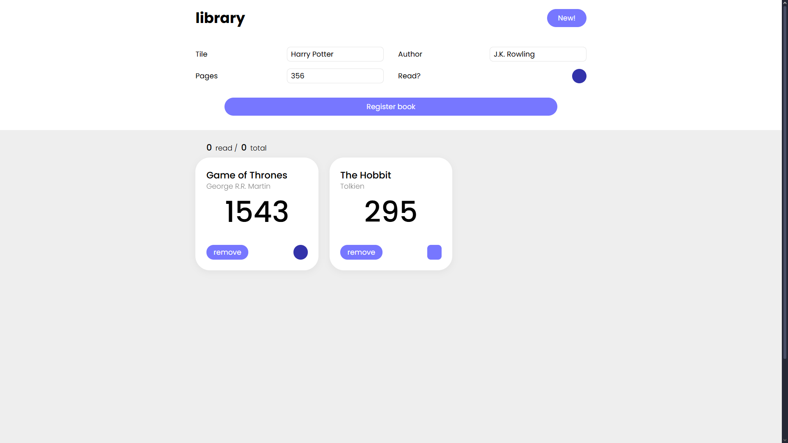

# Library App

The Library app allows users to keep track of books they have read, are currently reading, or want to read. Users can add books, mark them as read, and remove them from the list.

## Preview
Check the final live result in [this link](https://vicker14.github.io/library-app/)


## Features

- Add books with title, author, number of pages, and reading status.
- View the list of added books.
- Change the reading status of each book.
- Remove books from the library.

## Technologies Used

- HTML
- CSS
- JavaScript

## Installation

1. Clone this repository:
    ```bash
    git clone https://github.com/your-username/library-app.git
    ```
2. Open the `index.html` file in your browser.

## Credits

This project was created by following the instructions from [The Odin Project](https://www.theodinproject.com/).
